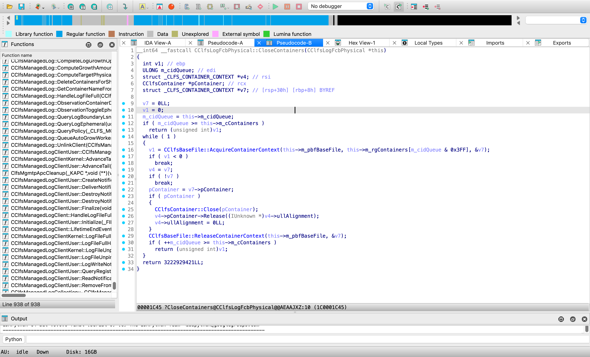

# CLFS-Gadgets

[**Windows CLFS Attack Surface R.I.P.**](https://techcommunity.microsoft.com/t5/security-compliance-and-identity/security-mitigation-for-the-common-log-filesystem-clfs/ba-p/4224041#)

## 010 Editor Template for BLF

[010 Editor Template to parse CLFS Log file (.blf)](BLF.bt)

## C Header for clfs.sys 

The [`clfs.sys.h`](clfs.sys.h) is C header generated by IDA, it's restore the most of symbols, C++ virtual tables, inheritance and abstract relationships.

It's helpful to analysis CLFS driver how works well and the vulnerability how to hijack function control flow.

## Reference 

- [ionescu007/clfs-docs](https://github.com/ionescu007/clfs-docs)
